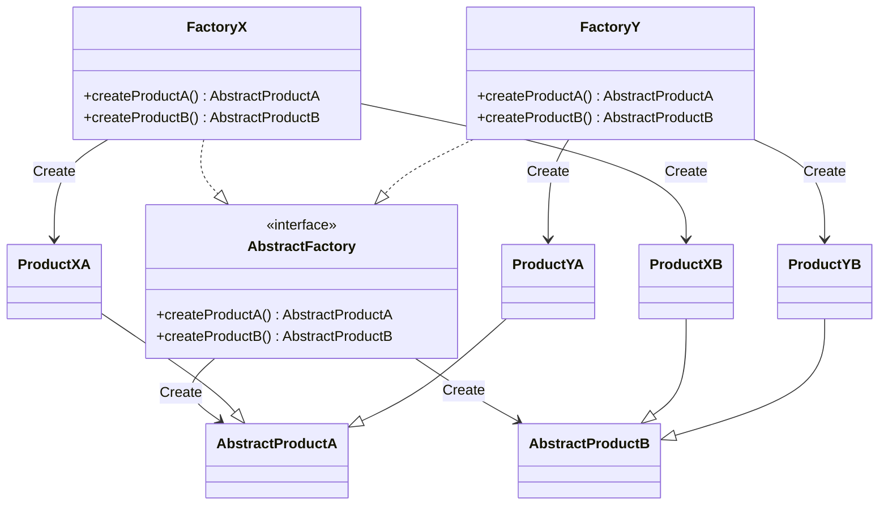

# Abstract Factory

- https://refactoring.guru/ja/design-patterns/abstract-factory
- http://marupeke296.com/DP_AbstractFactory.html
- https://designpatternsphp.readthedocs.io/ja/latest/Creational/AbstractFactory/README.html

## 概要

サブクラス・サブシステムの挙動をまるまるっと入れ替えたい場合に利用できるパターン。
共通項が存在する場合にそれらを Product としてまとめて、その Product を生成する Factory を複数用意する。
そして、 Abstract Factory を用意することで、サブシステムを動的に変更できるようにする。

Interface で Factory, Product を定義すると、プロパティを動的に変更できない。
そのため、 Abstract Class で定義することも多くありそう。

基本的に FactoryMethod と考え方は変わらず、それをより拡張したもの。
Builder パターンとも組み合わせられそう。

## 登場人物

- AbstractFactory
  - AbstractProductA
  - AbstractProductB
- FactoryX
  - ProductXA
  - ProductXB
- FactoryY
  - ProductYA
  - ProductYB

## UML

## メリット

サブシステムやサブクラス群が共通している場合に、それらをまるっと入れ替えられる。
これによって、動的に利用する Factory (サブシステム) を変更できる。

クラスの役割が小さくなるので、単一責任の原則が守りやすくなるのもメリット。

拡張側としては、 AbstractFactory に合わせて実装すればいいので拡張しやすい（同時開発しやすいとも言える）。

## 所感

FactoryMethod を拡張子、よりサブシステムを動的に変更できるものだなぁという感じ。
共通項を取るためにどこまで interface, abstract class に切り出すかの判断は厳しめ。
