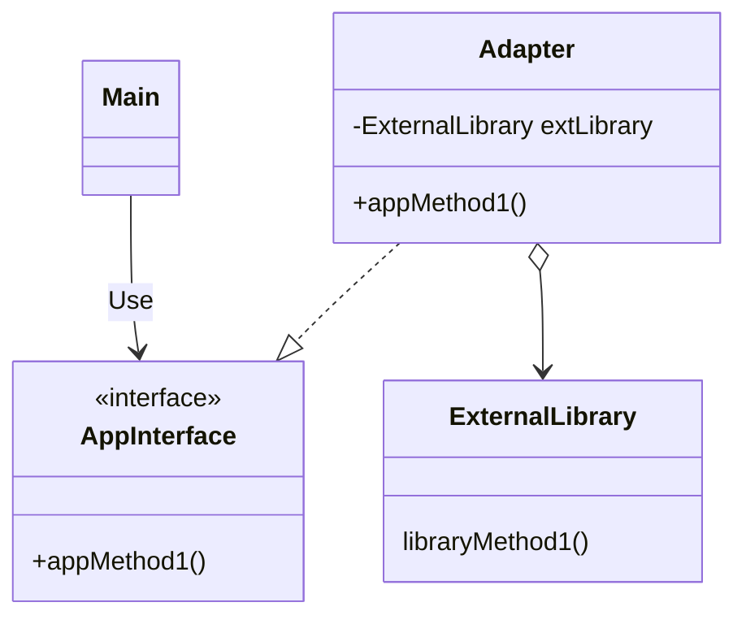

# Adapter

## 概要

外部ライブラリ X が存在し、この X には手を加えられない。
また、自作アプリにはある仕様で定められたインターフェース I があり、この I を用いたい。

この場合、 I と X を変換する Adapter A を用意する。
A は I のインターフェースを実装し、 I を実装したメソッドから X の API を呼び出す。

## 登場人物

- 外部ライブラリ
  - すでに存在しているライブラリ
  - これを修正することは不可とする
- アプリインターフェース
  - 自作しているアプリで利用するインターフェース
  - このインターフェースから外部ライブラリを呼び出したい
  - あくまでも主体側は自作アプリ側。自作アプリの仕様に合わせながら、外部ライブラリをなんとかして呼び出す
- Adapter
  - 自作アプリ側で用意し、外部ライブラリを呼び出すためのもの。
  - インターフェースを継承した struct から外部ライブラリのメソッドを呼び出す。

## UML

## メリット

- 外部ライブラリに手を加えなくて良い
- アプリインターフェースに変更を加えなくて良い
  - インターフェースがあるので既存のコードが壊れない
  - 新しい外部ライブラリを追加する場合は、新しい Adapter を用意すればいい
- 修正箇所が Adapter 1 箇所に集まる
- 1 外部ライブラリに対して 1 Adapter を用意すればいい
  - アプリが利用する複数のファイル形式があったとする。
  - PNG 画像ライブラリに対して PNG 画像アダプタを、エクセルライブラリに対してエクレルアダプタを... のように、外部コードに対してアダプタを用意すればいい
  - それら複数アダプタは共通の AppInterface を実装しているので簡単に受け取れる

