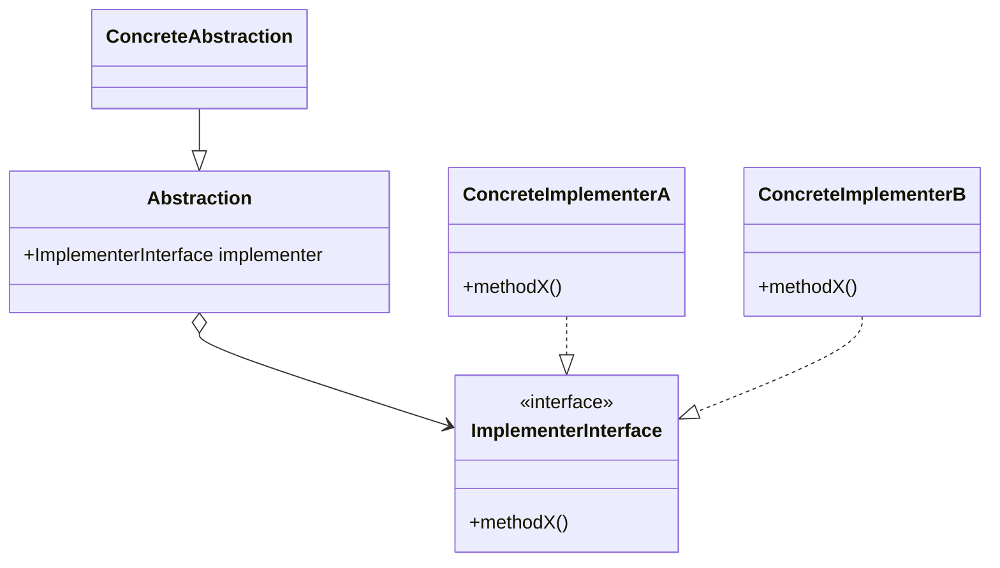

# Bridge Pattern

- http://marupeke296.com/DP_Bridge.html
- https://refactoring.guru/ja/design-patterns/bridge/php/example#example-1

## 概要

クラスの階層が深くなり、かつ多次元的になる場合がある。
このような場合に、異なる特性をもつクラスごとにサブシステムを形成し、それを Composition (メンバとしてインスタンスを持つ) で繋ぎ合わせる（ブリッジ）するもの。

機能（メイン側）のクラス群では、実装側のクラスのインスタンスをもち、実装をどう呼び出すかを規定する。
そして、実装側（サブ側）のクラス群で異なる状況ごとに合わせた内容を実装する。

GUI などにおいては、メインの構成が「機能」側で、特定の OS ごとに異なる処理は「実装」側で実装する。

## 登場人物

- Abstraction (抽象化)
  - メイン側
  - Implements 側のコードをどう呼び出すかを規定する
  - 抽象にしてもいいし、しなくてもいい
- ConcreteAbstraction
  - なくてもいい
- ImplementorInterface
  - 実装側のインターフェース
  - OS や SQL など状況に合わせた内容を実装することが多い
- ConcreteImplementor

## UML

https://mermaid-js.github.io/mermaid/#/classDiagram

## メリット

クラスの階層が深くなる、異なる次元が混ざり合う場合に、似た特性ごとに異なるクラス階層を用意し、それらを Bridge で繋ぎ合わせられる。
メイン側は interface だけをどう呼び出すかを規定し、実装側で各状況における実装を用意すればいい。

クラスの継承でこの深い実装を実現しようとすると、多次元的なクラスになっていく。
継承は結びつきが強いため、深くなるほど解消が難しくなる。
サブシステム（機能群）ごとに切り分けて、それぞれを Bridge (インスタンス Composition) で繋ぎ合わせればよい。
Go の思想原理に近い。

## 所感

「機能」「実装」などはあまり重要でないかも、と思った。
どちらかといえば、似た機能群ごとに異なるクラス群に分けて、それらを Composition でつなぐのが大事。
ふだん Bridge と意識していないことが、 Bridge であることが多いね。
