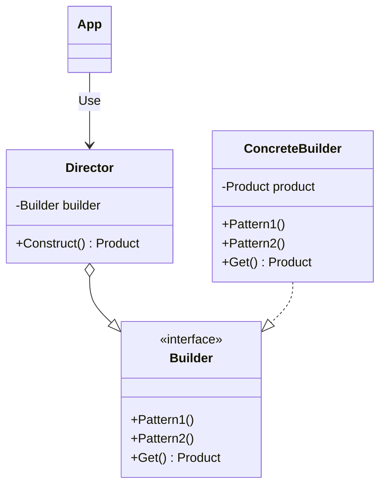

# Builder

## 概要

A というクラスに対して、 B, C, D, E... と複数のサブクラスを生やしていくと A のコンストラクタが肥大化してしまう。
また、インスタンスの生成方法がより複雑になると、そのインスタンスの再現が難しくなってくる。

そこで、 Builder interface でインスタンスの生成方法をより細かく規定し、実装したサブクラスがその規定された生成方法を実装する。
そして、 Director から Builder を呼び出すことで、内部がどうなっているかは分からないが Director からインスタンスを得られるという嬉しさがある。

## 登場人物

- Director
  - Builder のメソッドを呼び出す
  - 外部アプリから呼び出されるエントリポイント
  - あったりなかったりする
- Builder
  - インスタンスを生成する API
  - Builder 自身を生成することもあれば、 別に存在する `Product` を生成する場合もある
- ConcreteBuilder
  - Builder Interface を実装したもの
  - Builder 自身を生成することもあれば、 別に存在する `Product` を生成する場合もある

## UML

## 所感

正直あまりうまあじがわからない。
とくに Director の意義がわからない。

多くのサンプルなどで Director の Construct メソッドに定数が生まれており、その定数を用いて Builder のメソッドを読んでいる。
が、定数がある時点で Builder の柔軟性が失われる。
また、 Director のメリットは Builder Interface を実装しているどんなクラスも受け取れることだが、定数を Director に埋め込むことや、Construct メソッドの呼び出し方が規定される時点で複数の ConcreteBuilder を用意する必要がない気がする。
Director を利用する可能性としては、 ConcreteBuilder ごとに生成する内容が違う、という場合が考えられる。 CSV を作るのか、 HTML を作るのか、 はたまた Txt を作るのか。

Builder 単体であれば使い所はありそうな気がする。
コンストラクタが肥大化してしまうので、基本的な部分のみコンストラクタへ、それ以外は `SetXXX` に移動させる。
が、それは Builder Interface の複雑さは変わっておらず、 `SetXXX` も肥大化するのでは？と感じてしまう。

go_builder で書いてみたけど、多分このサンプルは本当に良くない。
Builder の良いところがなにもわからない。

うまあじとしては、アプリ側が Builder、そして Builder から生成されるインスタンスの中身を知らなくていいというところなのかなぁ...。
とにかく Director を呼べばいい感じにインスタンスが得られる、という状況が良いのか...?
