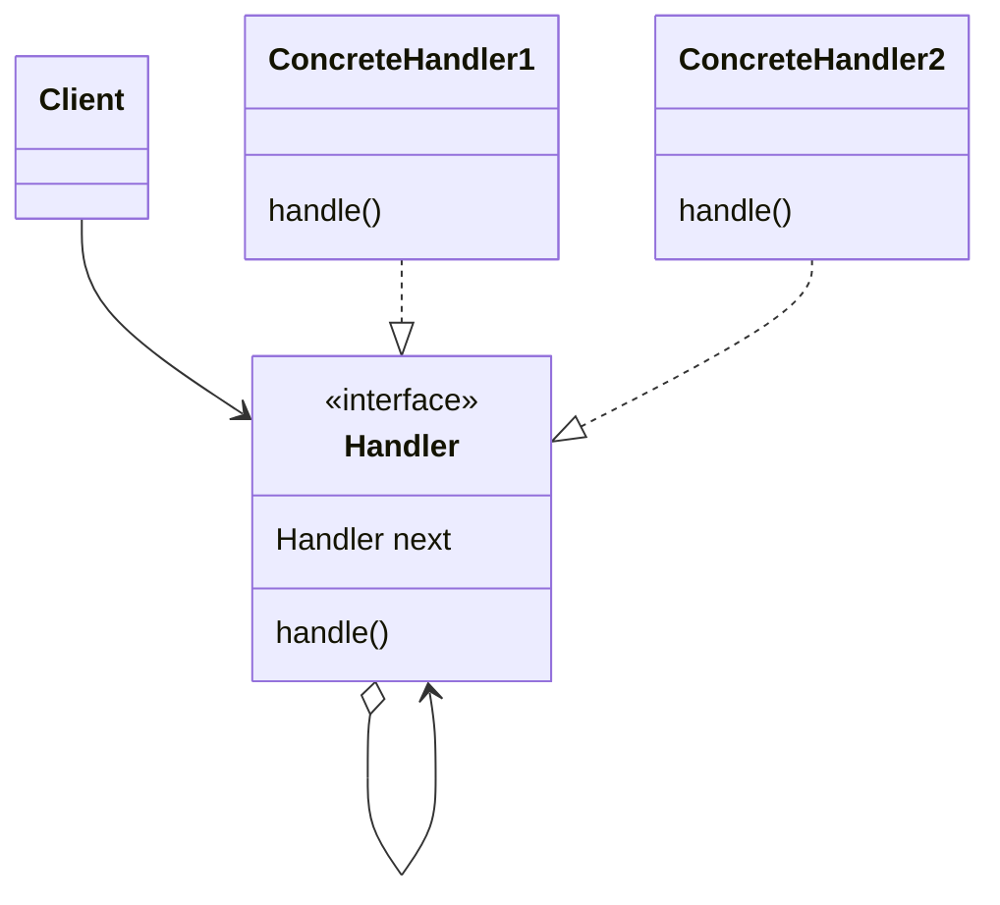

# Chain Of Responsibility

https://refactoring.guru/ja/design-patterns/chain-of-responsibility/php/example#example-1

## 概要

処理の責任をたらい回しにするもの。

使用方法は主に 2 パターンがある。

1. すべての処理を連鎖的に実行する
   1. ミドルウェアの実装
   1. 購買手続きまでの認証やチェック
1. どれかの処理が該当したらそこで打ち切る

## 登場人物

- Client
  - 処理を要求する
  - アプリコード
- Handler
  - 要求を処理する API
  - 自身で処理できるなら自身で処理し、できないのであれば次の Handler に処理を依頼する
- ConcreteHandler
  - 実際に実装したもの

## UML

https://mermaid-js.github.io/mermaid/#/classDiagram

## メリット

- Composite パターンと相性がいい
  - HTML の DOM の処理は Composite パターンであり, COR で処理する dom を決定している
- 開放閉鎖の原則
  - 具体的な Handler は自由に決定でき、既存の Handler を壊さない

## 所感

連鎖的に処理を移譲するため拡張しやすい。    
しかし、処理の順序を変えることや、どこまで実行するか、なにが実行されるかはなかなか変えられないので工夫がいる。   
「各 Handler が次の Handler を呼び出す」というパターンではなく、 Collection を用意して適切な Handler を返す（Factory） のようにするのもありだと思う。

PSR-15 の Middleware を簡易的にサンプルコードとして実装した。    
難しい...

- https://www.php-fig.org/psr/psr-15/
- https://speakerdeck.com/n1215/psr-15-request-handlerkarali-jie-surumiddlewarefalseshi-zu-mi
