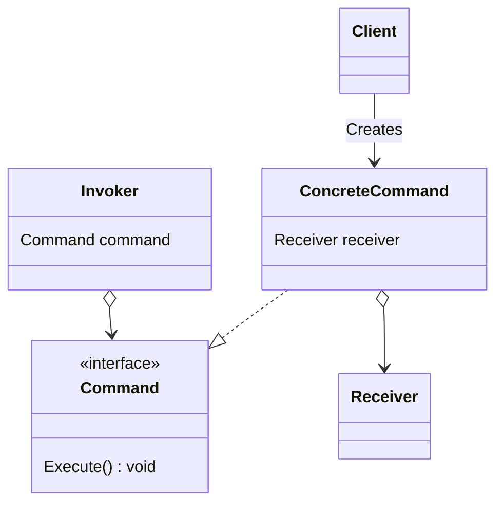

# Command

- https://refactoring.guru/ja/design-patterns/command
- http://marupeke296.com/DP_Command.html

## 概要

命令・処理自体を Class におきかえるデザインパターン。
これによって以下のメリットがある。

- UI と処理を分離できる
- 統一的な API で処理を統一し、自由に変更できる
- 処理を遅延的に変更できる

## 登場人物

- Command
  - API / Interface
  - Receiver に対して処理を実行するための interface
- ConcreteCommand
  - Receiver に対して具体的な処理を実行する
  - インスタンス化するときに Receiver をあらかじめコンストラクタで受け取っておく必要がある
- Receiver
  - Command によって処理が実行されるもの
  - 基本的に Command は `Execute()` のようなシンプルな API にするので、直接影響を及ぼすために Receiver を用意することがある
- Invoker
  - Command 命令を実行する役割
    - `Execute()` を外部から呼び出す役割
- Client
  - ConcreteCommand を生成し、 Receiver と紐付けるなど、もっともアプリに近い箇所
  - Invoker と一緒になっていることも多い

Receiver / Invoker / Client が一緒になることもあるなど、臨機応変に作成する。

## UML

https://mermaid-js.github.io/mermaid/#/classDiagram

## メリット

- 単一責任の原則
  - SOLID が守られる
  - UI と処理の分離
- 処理を複数保持・変更できる
  - Copy / Delete / Revert などと相性がいい
- 外部から処理を変更できる

## デメリット

`Receiver` や `Command` の API の取り決めが難しい。
どのように引数を与えて、処理を Receiver に伝えるか、などについて相談が必要。

## 所感

処理自体を class に抽出できるため、ロジックが UI にはみ出さなくなる。
また、自由に処理を変更できるのでよい。

現場でも見る機会が多く、かなり使いやすいデザパタだと思う。

Strategy パターンと似ているが、 Strategy はアルゴリズム自体を変更したい、という意図で利用する。
Command は操作をオブジェクトに抽出し、遅延実行したり、配列にしたりなど様々な用途に使う、という意図で利用する。
