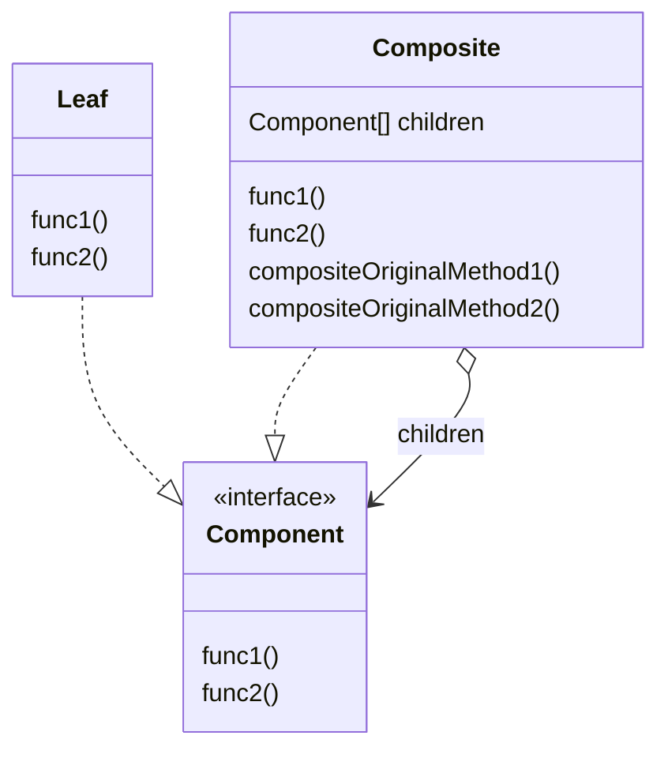

# Composite

## 概要

容器 (Composite) と中身（Leaf）が同一視できる場合に利用できるデザインパターン。

以下のような場合に Composite Pattern が利用できる。

- 木構造で表せる場合
- 「複数の要素」を 1 つの要素に捉えられる場合

## 登場人物

- ?Client
  - 利用者
  - あってもなくてもいい
- Component
  - Leaf & Composite を同一視するためのもの
  - Leaf & Composite に共通している部分のみ切り出すべき
    - すべて Component Interface(class) に切り出すと インターフェース分離の原則(SOLID の I)に反する
- Leaf
  - 要素・中身
- Composite
  - 要素・中身であり、かつ容器
  - ドメインによって Leaf と同じ機能を保つ場合と、ただの容器として徹する場合がある

## UML

https://mermaid-js.github.io/mermaid/#/classDiagram

## メリット

- 木構造などを簡易的に扱える
  - 中身と容器を区別しなくて良くなる
- 入り組んだ複雑な構造でもボトムアップに設計できる
- Composite Pattern が利用できる場合は非常に多く存在する
- 開放閉鎖の原則に従う
  - Component を満たす Class を自由に追加できる
- Prototype パターンと組み合わせやすい
  - 作成したツリーを簡易的にコピーできる

## 所感

ツリー構造に類似したドメインは多いため、多くの場合に Composite Pattern が利用できそう。

難しいのは　Leaf と Composite の共通部分の切り分けになりそう。

Composite は 2 つの機能を持つことになる。

1. Leaf 自体が持つ機能
1. Component をまとめあげる機能（各子要素に関数 `f` を適用し集約する）

上記 2 機能をもつため、 Component が公開する API に何を指定するかは意識する必要がある。

`go-composite` では、ディレクトリに entry を追加する `Add` は directory のみに生やしており entry interface に加えていない。    
共通部分のみ Component Interface に入れることでインターフェース分離の原則を守れるだろうと考える。
