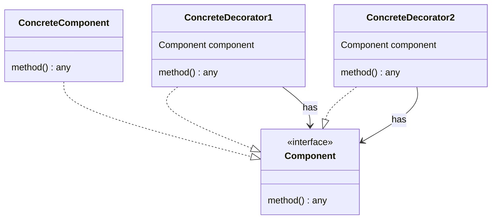

# Decorator

- https://refactoring.guru/ja/design-patterns/decorator/go/example
- http://marupeke296.com/DP_Decorator.html
- https://future-architect.github.io/articles/20221021a/
  - 実際のケースで説明されていて分かりやすい

## 概要

`ある処理A`の`前後`に追加のカスタム処理を加えたい場合に、`ある処理A` をラップするパターン。   
ただ純粋にラップするのではなく、**A の API (Class, Interface) と揃える**ことによって、外部から見ると A のままにすることができる。

言語によっては組み込みで実装されているものもあるが (python など)、 API が変わることがあるため、 Pattern の視点でみれば純粋な Decorator とは異なるかもしれない。

Composite パターンに類似しているが、 Composite は再帰的なツリー構造を処理したい場合に利用できる。
また、処理をまとめあげる、ということに Composite は専念している。

一方、Decorator はある処理・オブジェクトを外側から修飾することを実現しており、子をそれぞれ 1 つしか持たない。

## 登場人物

OOP の場合

- Component
  - 共通のインターフェース（ベース）
  - 外部から利用する場合 この Component の振る舞いが変わらないようにする
- ConcreteComponent
  - インターフェースを実装したベースクラス
  - この CreateComponent が Decorator によって装飾される
- Decorator
  - Component を内部に持つ
- ConcreteDecorator
  - Component の API を実装することによって、外部から見れば Component そのもののように振る舞う
  - 内部にもった Decorator.Component を呼び出す

Go の場合

- Component
  - Interface
- ConcreteComponent
  - ベースとなる struct
- ConcreteDecorator
  - 内部に Component をもつ

Decorator クラス自体を持たないくて良い

## UML

https://mermaid-js.github.io/mermaid/#/classDiagram

Go

## メリット

- 無駄なクラス・継承などを増やさずに `好きな個数` 処理をあとから追加できる
  - デフォルトの処理に対して、外部から好きなだけエフェクトを加えられる
  - 内部に対して変更を加えない
- 外部から見れば振る舞いを変更していない
  - 同じ API を用意すれば、外から見れば違いがわからない
  - go の外部 package の Interface を実装して機能を拡張できたりする

## 所感

かなり便利なパターンだなぁという感じ。   
外部からの振る舞いが変わっていないので、外部パッケージの拡張などにも利用しやすい。

が、内部の処理そのものを変更できないので、そこは実際に処理を変えたものを用意するしかない。
あくまで、前後に変更を加えるのみしかできない。    
中身自体を変えたい場合は Strategy を利用すべき

Adapter も似ているが、 Adapter は API が異なる場合に利用できる。   
Adapter は異なる構造・仕組みをなんとか繋ぎ合わせる場合に利用するので、同じ構造を提供する Decorator とは環境が異なる。

