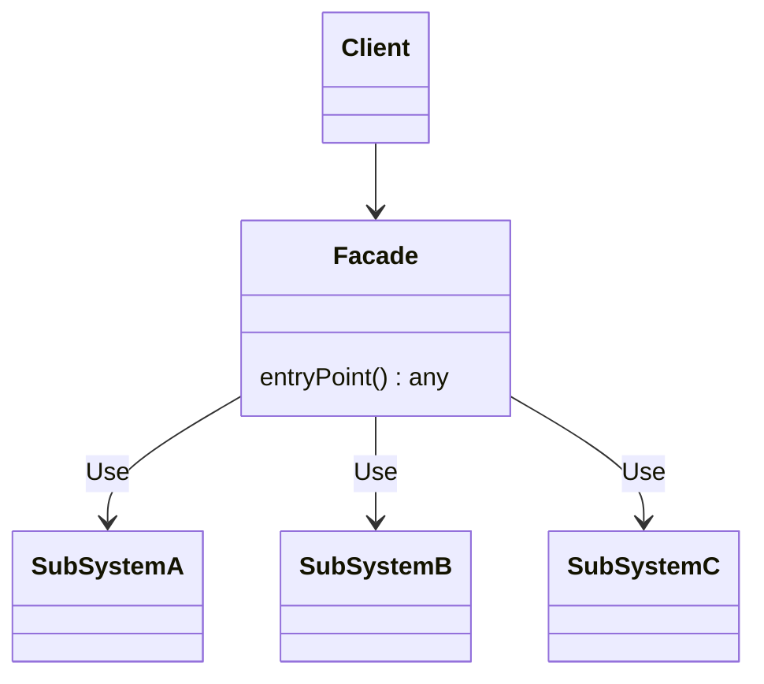

# Facade

- https://refactoring.guru/ja/design-patterns/facade
- http://marupeke296.com/DP_main.html

## 概要

Facade (ファサード) パターン

複雑なサブシステムに対して、分かりやすい API を用意するパターン。
非常にシンプルだが、利用する頻度は高そう。

Facade in Facade もある。

## 登場人物

- Client
  - 利用者
- Facade
  - エントリポイント
  - サブシステムを適切に呼び出す
- SubSystem A, B, C
  - 複雑に構成されているサブシステム

## UML

https://mermaid-js.github.io/mermaid/#/classDiagram

## メリット

- 複雑なサブシステムを意識することなく、かんたんに呼び出せるエントリポイントを提供できる
  - その分 Facade が God Class になる可能性があるため注意する
    - より小さな Facade に分割したり別のでざぱたを導入するなど
- Adapter に近いよ
  - Adapter は単一の外部機能の抽象化
  - Facade はより大きいもの

## 所感

便利な考え方なので、使う頻度は高い。

しかし、 God Class になりがちなので注意する。

