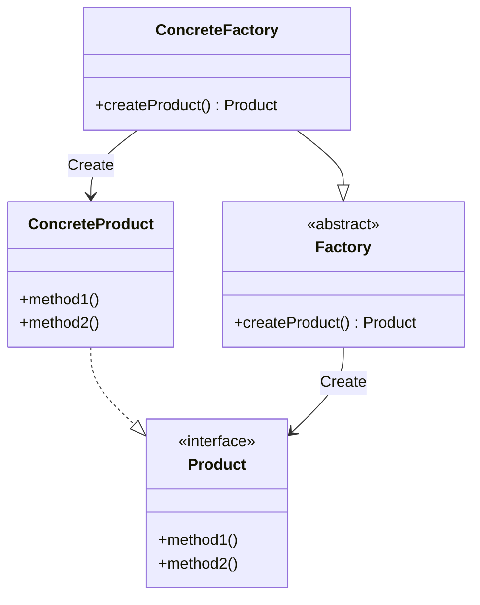

# FactoryMethod

https://refactoring.guru/ja/design-patterns/factory-method

Factory Pattern とは別物
https://qiita.com/shoheiyokoyama/items/d752834a6a2e208b90ca

## 概要

インスタンスの生成をサブクラスに任せるデザインパターン。

Factory とはそのまま工場を指し、さまざまなサブ工場が独自のプロダクトを生成する。
Factory の立場としては、サブ工場がどのようにどんなプロダクトを作っているかは知らなくて住む。
Factory はそれぞれ共通して生成されるプロダクトの `Interface` のみ知っており、あとはサブ工場に任せる。

## 登場人物

- Factory
  - インスタンスを生成する工場
    - 実際の生成自体はサブクラスに任せる
  - 気をつけるべき点として、**インスタンスを生成するのみが Factory ではない**
    - 多くの場合 Factory は何かしらの Collection Entity であるなど、インスタンスを生成する以外の役割・メソッドを持っている。一部機能として、 Product の生成機能を持っている。
    - サブ工場が生成した Product を管理し全体を操作するようなメソッドをもつこともある
    - よって、インスタンス以外を生成する機能を Factory が持つことのほうが多い
- Product
  - interface or abstract class
  - 工場が生成するプロダクトすべてが共通してもつメソッドを規定する 
- ConcreteFactory
  - 作成したい ConcreteProduct ごとに ConcreteFactory を生成する
- ConcreteProduct

## UML

## メリット

- フレームワークやライブラリを開発するときに、共通の API (Interface) を規定し、 Factory を用意する
  - 利用者側は独自の ConcreteProduct, ConcreteFactory を用意し、 Factory に投げれば良い
- 開発段階でどのような Product が生成されるか分からない、今後拡張される可能性がある場合などに、変更に耐えれるようにしておける
  - Factory を用意し、サブクラスが対応する
- ConcreteFactory をシングルトンにすれば、オブジェクトを使い回せる

