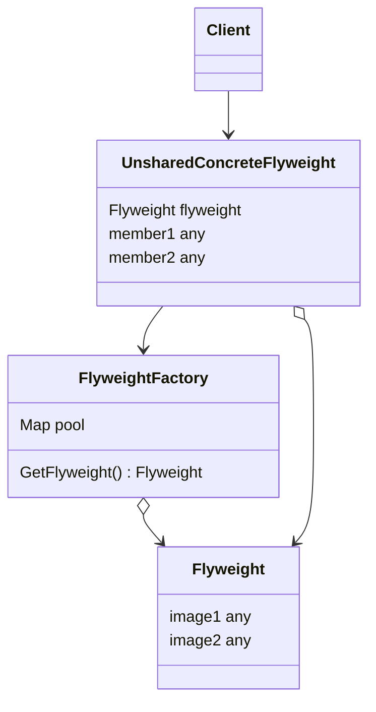

# FlyWeight

- https://refactoring.guru/ja/design-patterns/flyweight/
- http://marupeke296.com/DP_Flyweight.html

## 概要

同じデータをできるだけ使い回すデザインパターン。
Singleton と似ているが、単一データを扱うのか、複数の異なるデータを扱うのかという点で異なる。

`Particle` というゲームの弾を考える。
`image` というバイナリ情報も持たせてしまうと、大量の弾が作られたときに同じイメージが複数生成されメモリを圧迫してしまう。

```go
type Particle struct {
    x int
    y int
    image string
}
```

そこで、 intrinsic (本質的な) 情報と extrinsic (状況によって可変的な) 情報とを分離する。

intrinsic な情報に関しては同じインスタンスを使い回せばよく、 Factory が管理する。
この intrinsic な情報を flyweight オブジェクトと呼ぶ。（重い image などを管理するので、軽量級ではなくないか...?）

## 登場人物

- Flyweight
  - intrinsic な情報を持つ
  - 外部から
  - 変更できないようにする
- FlyweightFactory
  - Flyweight を生成するファクトリ
  - pool を持ち hash で管理する
- UnsharedConcreteFlyweight
  - extrinsic な情報を持つ
  - 個々の Entity で変わる可変的な情報を持つ
  - 内部に flyWeight オブジェクトの参照を持つ

## UML

https://mermaid-js.github.io/mermaid/#/classDiagram



## メリット

- 大量のインスタンスを生成することを防ぐ
  - 「重い」インスタンスは共有する
  - 軽い&可変的な情報については共有しないで別々にする

## 所感

大量のメモリを使っているときなどに非常に使いやすいパターン。    
共有して使ってよいインスタンスであれば Flyweight を導入するとよい。

注意点として、同じインスタンスを使っているため、決して書き換えないようにする必要がある。他のインスタンスに影響が出てしまう。    
また、 Flyweight を入れることによって実装が重くなるため、その点についても注意する。
