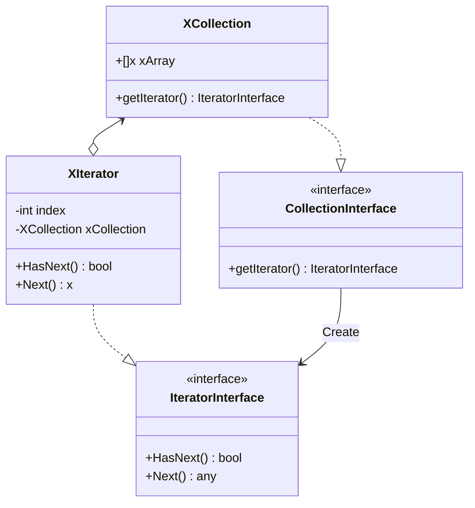

# Iterator

## 概要

Collection を走査する Iterator を返す。
そして `Iterator.hasNext` がある限り 1 つずつ要素を取得するデザインパターン。

for を使用しないためインデックスなどを考慮しなくてよい。
また、複数の Iterator を生成できる。

## 登場人物

- Collection Interface
  - getIterator で Iterator Interface を返す
- Iterator Interface
  - hasNext, Next を持つ
  - Interface で持つことで複数のタイプの Iterator を汎用的に取れる
- XCollection (struct / class)
  - 実際のコレクション
  - XIterator を Iterator Interface として返す
- XIterator
  - 実際のイテレータ
  - XCollection のポインタを持つ

## UML

## メリット

- for を使用しないためインデックスを考慮しなくてよい。
- Iterator を複数生成できる。

