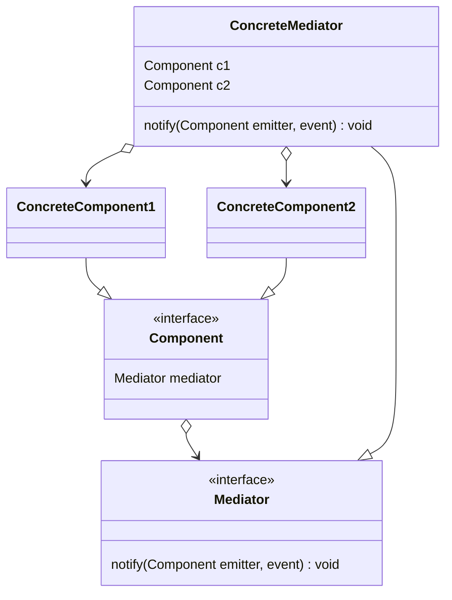

# Mediator

- https://refactoring.guru/ja/design-patterns/mediator
- https://refactoring.guru/ja/design-patterns/mediator/php/example#example-1
- http://marupeke296.com/DP_Mediator.html

## 概要

個々のコンポーネントが互いに依存している状態を整理するためのデザインパターン。

Mediator という仲介役を用意し、各コンポーネントは Mediator とのみ通信を行うようにする。

## 登場人物

- Mediator Interface
  - 通信の仲介役
- Component Interface
  - 個々のコンポーネント
  - Mediator を内部に持ち、 Mediator に通信を依頼する
  - Mediator からの通信も受け付ける
- Concrete Mediator
- Concrete Component

## UML

https://mermaid-js.github.io/mermaid/#/classDiagram

Mediator.notify は Component 内部から呼び出される。
たとえば、 ButtonComponent の click メソッド内部から `dialog.notify(this, "click")` のように実行される。

## メリット

- 複数の多対多の依存をなくし、1対多のシンプルな依存関係にする
- 開放閉鎖の原則を満たす
- うまく設計されている個コンポーネントに複雑なロジックを集めなくてよくなる
  -  デメリットにあるように、 Mediator がかわりに犠牲になる

## デメリット

- Mediator にすべての処理が集中し、複雑化する
  - Mediator は使い捨てになる

## 所感

UI におけるコンポーネントなど、複数のコンポーネントが互いに依存しあう場合に、それを管理する Manager / Mediator を用意する。
ゲーム制作を行っていた際も、複数のコンポーネントを管理する Manager がよく発生していた記憶がある。
これらの Mediator / Manager は God Class になる可能性が高いため、適度に細分化する必要がある。

サンプル実装では Mediator と Observer それぞれに類似している Event Dispatcher パターンを実装した。

Mediator に似ている Observer との違いがあまりわからないですね... 
