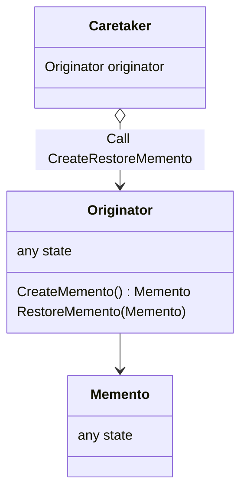

# Memento

- https://refactoring.guru/ja/design-patterns/memento
- http://marupeke296.com/DP_Memento.html

## 概要

エディタの操作やゲームのセーブデータなど、とあるオブジェクトの内部状態を保存したい場合に利用できるデザインパターン。

Originator が状態をもち、その状態を Memento という保存専用クラスへ保存する。     

Originator, Memento の内部状態を他のパッケージ (CareTaker) からはさわれないようにすることが重要である。
（外部公開しているままだと、良きせぬ変更が行われてしまうため）

Memento という別のクラスにセーブ用の状態を分けることによって、 CareTaker から内部構造を触りづらくできる。
また、 JSON / YAML / Database というように保存方法が変更されたとしても、 Originator には影響を広げずにすむ。

## 登場人物

- Caretaker
  - Client / Main などの外部パッケージ
  - Caretaker は Originator が作成したセーブデータ Memento を保持するだけ
  - Caretaker から Originator / Memento の内部状態にアクセスすることは防ぐように実装する
- Originator
  - ゲームやエディタの状態（ロジックを含むこともある　実装するドメインによる）
  - Caretaker からの指示によって、以下のメソッドで Memento を作成・復元する
    - CreateMemento
    - RestoreMemento
- Memento
  - Originator の内部状態を保持するだけ

## UML

https://mermaid-js.github.io/mermaid/#/classDiagram

## メリット

- 変更履歴や状態を安全に保存できる
  - 外部パッケージからは触らせない
- 変更内容を Memento に吐き出すことによって、その後自由に扱える
  - Memento の配列をもっておけば　好きなだけ復元可能
  - JSON / YAML など好きな形式に変換可能
    - Originator のロジックが汚れない    

## 所感

Memento になにをもたせるかはデータの内容によって考えるべき。

もしデータに超高解像度の動画や画像があった場合、何個も Memento を作成すると簡単にメモリを食いつぶしてしまう。
差分 Memento を作成するかどうかなどを検討すべき（実装が複雑になるが）。
