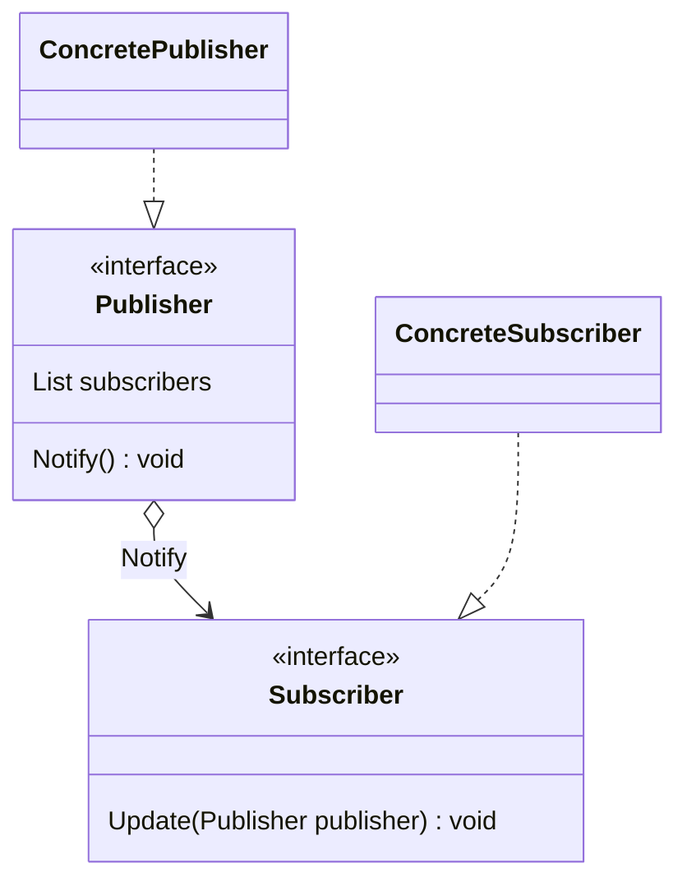

# Observer (Pub-Sub Pattern)

- https://refactoring.guru/ja/design-patterns/observer/php/example#example-1
- https://refactoring.guru/ja/design-patterns/observer/go/example

## 概要

Observer パターンと呼ばれているが、動作としては Pub-Sub パターンと呼ぶほうが直感的であるため、ここでは Pub-Sub と呼ぶ。

Publisher がデータやトピックの変更を管理し、変更があった際はその内容を Subscriber らに伝える。    
よって、 Publisher から Subscriber への単一方向のデータ通信を想定している。

UI や MVC など、データやイベントの変更が発生した際に、 View にその変更を伝える、というのが主な利用方法。

## 登場人物

- Publisher Interface
  - なにかしら変更があったら Subscriber に通知する
- Subscriber Interface
- Concrete Publisher
- Concrete Subscriber

## UML

https://mermaid-js.github.io/mermaid/#/classDiagram

## メリット

- データや UI など、変更イベント発火とイベント受信を別々に分離できる
- 一対多の関係性にできる
- Subscriber が拡張しやすい（開放閉鎖の原則）

## Mediator との違い

Mediator は個々のコンポーネントが互いに通信しあう場合に、その通信経路を Mediator に固定させることに主眼がある。
そのため、 Component から Mediator への通信も存在する。

一方で、 Pub-Sub パターンでは一方向性がデフォルトであり、 Publisher の状態変化の通知をクリーンに行うためのものである。

## 所感

実装はほとんど [Mediator](./../Mediator/go-mediator/) と等しいため省略している。

かなり使い所が限られているが、その分野においては使いやすいデザインパターン。

UI など、イベント・シグナルを受け取ってその内容をもとに処理を行うようなものに使うと良さそう。

