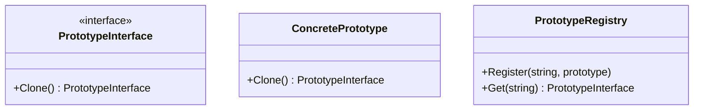

# Prototype

## 概要

インスタンス自体から新しいオブジェクトを生成するパターン。
ゲームにおける図形やウィンドウなど、クラスからコンストラクタを呼び出すことによって生成することが難しい場合に利用する。

## 登場人物

- PrototypeInterface
  - Clone メソッドを持つ
- ConcretePrototype
  - PrototypeInterface を実装する
  - 自身をコピーして返す
- (PrototypeRegistry)
  - 必ずしも利用するものではない
  - Hash において、文字列に対して PrototypeInterface を格納する
  - コピーしたいインスタンスを Registry に登録しておいて、使いたいときに取り出す

## UML

## メリット

コンストラクタから生成するのが大変な場合などに利用すべき。
また、クラスの内部にインスタンスをもち、そのインスタンスがインスタンスをもち... のようにプロパティが深く再帰的になっている場合は複製が大変。
このような場合に Clone を再帰的に実行すれば良い。

