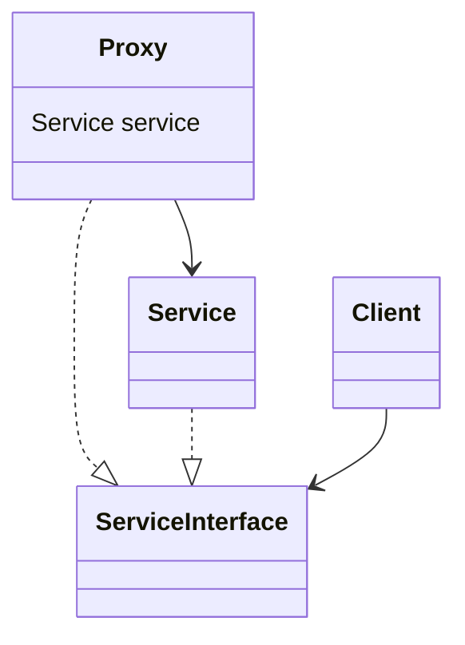

# Proxy

- https://refactoring.guru/ja/design-patterns/proxy
- http://marupeke296.com/DP_Proxy.html

## 概要

Service の処理を肩代わりするパターン。

Service のロジックについて、以下を追加したい場合がある。

- キャッシュ
  - 一度取得した twitter 情報をキャッシュしておきたいが、サードパーティライブラリにその機能がついていない
- ロギング
- 認証
- 遅延ロード
  - できるだけ DB につなぎたくない
  - 必ずしも DB につなぐことがなく、そもそもほとんどのケースでは繋がない

上記のような場合に、 Service のかわりとして Proxy を用意し、 Proxy が一部の処理を肩代わりする。
担当できない部分については Service に丸投げする。

Proxy と Service に共通した ServiceInterface を用意することによって、 Client からは中身を意識することなく利用できる。
（Client も Service も Proxy がいることに気づかない。 Proxy のみが知っている）

## 登場人物

- Service
  - ロジック  
- Proxy
  - Service を内部に持つ
- ServiceInterface
  - 共通API

## UML

https://mermaid-js.github.io/mermaid/#/classDiagram

## メリット

- Service の実装を変えることなく、ロギングや認証・遅延評価などの処理を追加できる
- Client からは処理内容が変わらないようにみえる

## デメリット

- すでに Service の API が大きい場合、 Proxy の作成が複雑化する
  - Service の呼び出し箇所が多いと、その入れ替えに時間がかかる

## 所感

Adapter や Facade に似ている。

Adapter は異なる API を強引にラップする場合に利用する。

Facade は異なる API 群・サブシステムがあり、それらにアクセスしやすい簡単なエントリポイントを用意するために利用する。

似たようなデザパタはあるが、 Proxy はオリジナルの処理をそのまま少し変更する場合に利用しており、利用目的が異なる。

