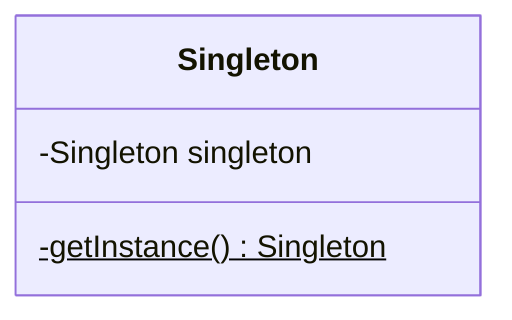

# Singleton

## 概要

クラス自身の static や大域変数にインスタンスを格納し、常に同じインスタンスを返すパターン。
常に同じインスタンスを返せるが、きちんとした設計を行った場合シングルトンはアンチパターンとして捉えられることが多い。

## アンチパターンの理由

#### 単一責任の原則に反する

シングルトンを利用する場合、対象とするクラスは 2 つの機能を持つ。

- クラス自体のビジネスロジック
- シングルトン

本来クラスはアプリを実現するための処理のみを自身が持つべきだが、それ以外に「常に同じインスタンスを返す」という機能を持ち始める。
常に同じインスタンスを返したい場合は

- DI Container
- Factory Pattern

などを利用して、インスタンスを生成するという責務を別のクラスに用意したほうが良い。

#### テストしづらい

シングルトンでは、インスタンスを常に内部に持ち続ける。
よって、外部からの注入が行えず、 Mock, Stub を利用できない。

また、他のユニットテストの実行によってシングルトンクラスの結果が変わってしまう。
ユニットテスト用にリセットメソッドを持つのもおかしい状態になる。

## UML

## メリット

