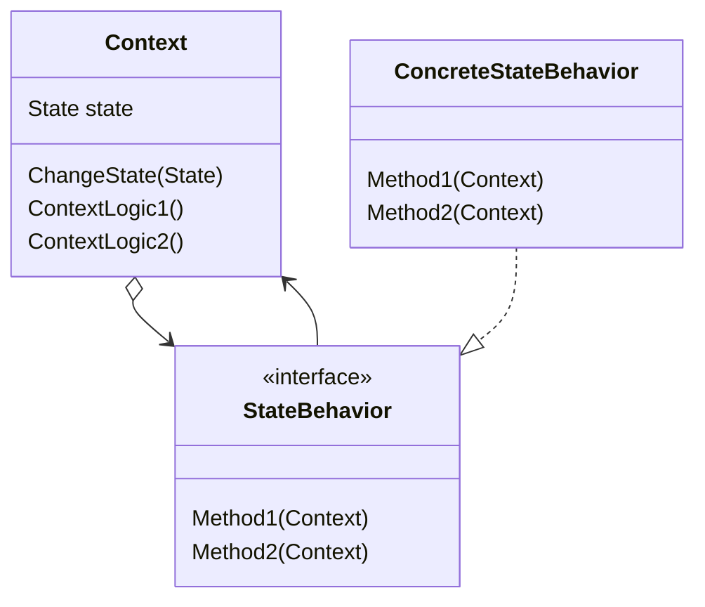

# State

- https://refactoring.guru/ja/design-patterns/state
- http://marupeke296.com/DP_State.html

## 概要

複数の状態が存在し、それらの状態がそれぞれ同じ API をもつ場合に利用できるデザインパターン。

ある Context に複数の状態が存在するとき、内部の関数内に `if 文` が条件ごとに大量に発生することになる。    
初期ではその実装でもなんとかなるが、仕様の変更によって状態が追加されていくたびにコードが肥大化していく。

そこで、「状態」自体(タイマーにおける秒数やユーザなどの　Context を成り立たせる変数)を Context Class に閉じ込めて、各状態での処理を State API interface に宣言する。
これによって、 State ごとに異なる処理を記述でき、 Context は state のみを持つだけで良い。

ここでは、 `State` という言葉がしっくりこないため、 `StateBehavior` という名前を利用する。
というのも、`State Interface` が行っていることは各状態ごとに行う `処理` の記述であり、`状態` という言葉とずれていると感じるため。
また、秒数やユーザなどのメンバ変数は `State Interface` がもつのではなく、`Context` 側が持つため。

## 登場人物

- Context
  - 複数の状態によって振る舞いを変える Entity Class
  - 秒数やユーザなど、共通してもつ状態メンバ変数は Context が持ち、 `StateBehavior` には持たせない
    - StateBehavior には Context 自体を渡す
- StateBehavior
  - Interface
  - 各状態で行うべき処理の API
- ConcreteStateBehavior
  - 具体的な実装 
  - 春夏秋冬であれば、それぞれの季節での具体的な処理を異なる4クラスそれぞれに書く

## UML

https://mermaid-js.github.io/mermaid/#/classDiagram

## メリット

- `状態` ごとの処理を API として記述できる
- Context は state メンバのみを持つだけでよい
  - 複雑な if は出てこない

## 所感

状態遷移をどこから実行するか？は注意が必要となる。

各 StateBehavior 内部から context.ChangeState を呼ぶのが一つの手として考えられる。
しかし、どの ConcreteStateBehavior によって状態が変わるのかが分かりづらくなる。

もう一つの方法としては、 Mediator のように Context がすべてを管理する方法がある。
しかし、状態遷移が多くなると Context 内部に書かれる遷移処理が大変なことになる。

