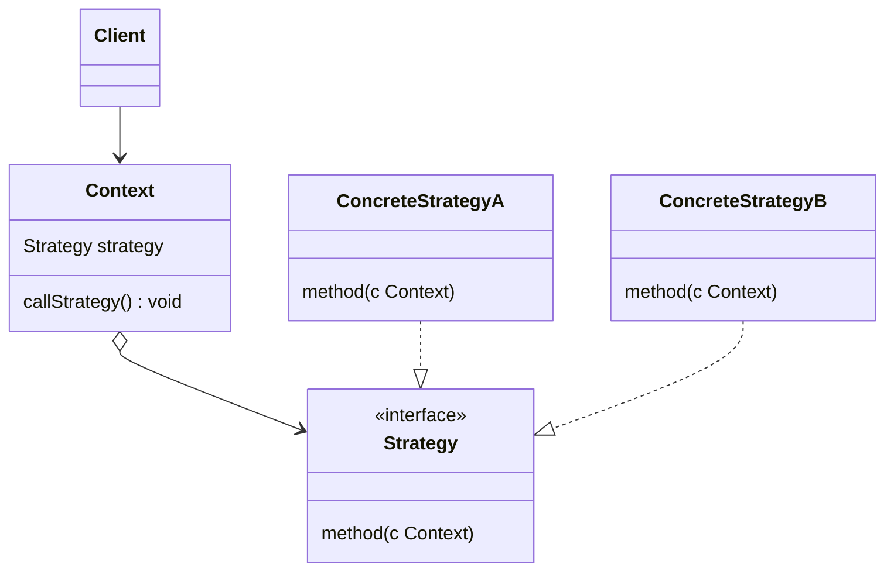

# Strategy

- https://refactoring.guru/ja/design-patterns/strategy
- https://refactoring.guru/ja/design-patterns/strategy/go/example
- http://marupeke296.com/DP_Strategy.html

## 概要

振る舞いパターンの 1 種。

プロダクトを作るうえで、ロジックに含まれる特定のアルゴリズムが存在する。
このアルゴリズムがある単一のものではなく、複数のアルゴリズムを利用する場合がある。

たとえば、ピクミンというゲームではオリマーがピクミンの隊列を移動させる。
このとき、ピクミンの移動方法では以下のようなアルゴリズムが考えられる。

- オリマーによる指示でその方向に移動する
- オリマーが移動したときに、 boid パターンで移動する

上記のアルゴリズムをすり替えられるように、抽象的な Strategy と実際に実装した ConcreteStrategy を用意する。

そして、Context (プロダクトの State をもつ) から Strategy を呼び出す。

## 登場人物

- ?Client
  - ない場合がある
  - Context & Strategy を wire する
- Context  
  - プロダクトの State をもつ
  - Strategy を呼び出す
- Strategy
  - interface
- ConcreteStrategy

## UML

https://mermaid-js.github.io/mermaid/#/classDiagram

## メリット

- 具体的なロジックとアルゴリズムを入れ替え可能
  - 設計と実装フェーズを分岐できる
  - 拡張性が増す
- 開放閉鎖の原則

## 所感

シンプルかつ良く使うパターンといえる。

なにかすり替えられそうな特定のロジックがあった場合 Strategy パターンを利用すればいい。
むしろ、普段意識せずに Strategy パターンを利用しているといえる。

Bridge パターンにかなり類似している。
Bridge は抽象と実装部分を分離し、独立に開発できるようなものであり、かつ異なるドメインを扱うもの。    
Strategy は Context を保持し、自身の情報をもとに自身のロジックを抽象化する、に近い気がする。
