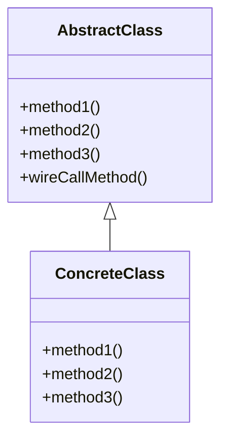
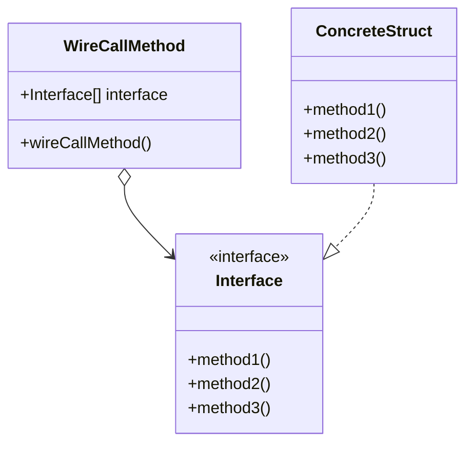

# TemplateMethod

## 概要

スーパークラスで以下 2 種類のメソッドを用意し、スーパークラスで全体の挙動を定めながら、細かい実装はサブクラスに移譲する。

- 継承を想定しない、 abstract を配線するメソッド
  - abstract メソッドをどう呼ぶかを規定している。
- abstract メソッド。サブクラスで実装される。

## 登場人物

- 抽象クラス
  - 一部のメソッドが abstract
  - 上記 abstract メソッドを配線する、具体メソッドを持つ場合がある
- 具体クラス

## UML

Class Pattern (PHP など)

## メリット

abstract で細かい挙動を変更できる。
かつ、抽象クラス側で「abstract メソッドの `配線`」メソッドを用意できるため、細かい挙動をどうまとめあげるかを抽象クラス側で規定できる。
よって、呼び出し方などは一箇所にスーパークラスに集められ、重複して書くことを避けられる。

## Go

Go ではスーパークラス・サブクラスがない。

そこで、サブクラスに相当する struct らに実装してほしい interface を用意する。
そして、 その interface を持つ struct を作り、その struct で interface.method の呼び出し方を規定する。

`go_template_method` では IToBinary をサブクラスに相当する struct らに実装してもらう。
そして、 IToBinary のメソッドをどう呼ぶかを ToBinary の Convert メソッドで定義している。

