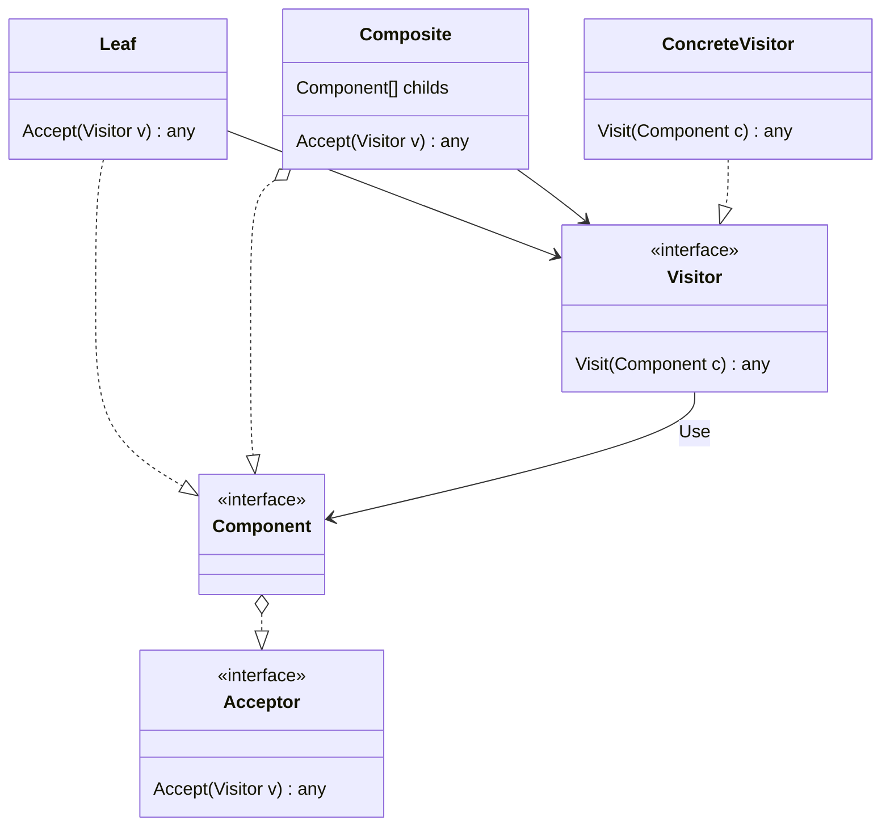

# Visitor

- https://refactoring.guru/ja/design-patterns/visitor
- http://marupeke296.com/DP_Visitor.html

## 概要

Composite における `処理` と `データ構造` を分離したパターン。

Composite では、 `データ構造` を表すツリー構造に加えて、ツリーをまとめあげるという処理の 2 つの責務を担っている。    
そこで、`処理` 単体を `Visitor` として外部に抽出し、 `Composite` はデータの再帰的構造を保持するだけに専念させる。

これによって、 Composite はどのようなデータを持てばいいかだけ意識すればよい。    
かつ、 Visitor はそれらのデータを自由に行き来し好きな操作を行える。

これらを分離することによって、ツリー構造に対して行いたい処理を自由に CustomVisitor を作成することで実現できる。
これによって、開放閉鎖の原則を守れる。

## 登場人物

- Composite Pattern
  - Component
  - Leaf
  - Composite
- VisitorInterface
  - Visit(Component) によって、受け取った Component で処理を行う
- CustomVisitor
  - 実際の処理を実装する
- AcceptorInterface
  - Component は Visitor を受け取る AccepterInterface を保持する
  - Accept(Visitor v) で、`v.Visit(this)` を実装する

## UML

https://mermaid-js.github.io/mermaid/#/classDiagram

## メリット

- データ構造と処理を分離できる
- 開放閉鎖の原則を満たしている
  - データ構造も自由に拡張できる
  - 処理も新しい処理クラスを追加することによって自由に拡張できる
- Iterator Pattern を利用することで、要素に対する処理の構造をさらに抽象化できる

## 所感

Composite と比べて、データ構造と処理を分離できるのでいい感じ。

ただ、 Accept Visit でやり取りするデータ構造が難しいなと感じた。    
なにか処理をまとめあげるためには、それ用のデータ構造が必要であり、それを Accept, Visit は引数などで知っておく必要がある。

汎用的にしておくのであればそれぞれ any で定義するしかない。

また、 Accept は `Visitor v` という単一の引数しか受け取れない。（適宜必要な変数を増やしてしまうと、別の Visitor を受け取りづらくなる。）    
この引数の問題を解決するには、 Visitor の処理側の struct に一時的なメモリとして変数を保存しておいて、やり取りするしかないんだろうか... 
